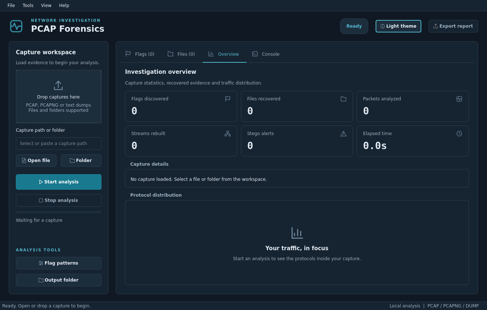

# PCAP Forensics & Flag Extraction

<p align="center">
  <a href="https://github.com/Gabzkk/PCAP-ANALYZER/blob/main/LICENSE"></a>
  <a href="https://www.python.org/"></a>
  <a href="https://pypi.org/project/PyQt6/"></a>
  <a href="https://scapy.net/"></a>
  
  
  <a href="https://github.com/Gabzkk"></a>
</p>

<p align="center">
  <b>A high-performance desktop application and CLI tool designed for network forensics, incident response, and Capture The Flag (CTF) challenges.</b>
</p>

<p align="center">
  
</p>

---

## Table of Contents

- [Key Capabilities](#key-capabilities)
- [Architecture & How It Works](#architecture--how-it-works)
- [Prerequisites & Installation](#prerequisites--installation)
- [How to Use (GUI Mode)](#how-to-use-gui-mode)
- [How to Use (CLI Mode)](#how-to-use-cli-mode)
- [Configuring Custom Regex Patterns](#configuring-custom-regex-patterns)
- [Testing & Synthetic Traffic Generation](#testing--synthetic-traffic-generation)
- [Project Structure](#project-structure)

---

## Key Capabilities

- **Streaming Packet Ingestion:** Utilizes Scapy's streaming `PcapReader` to process large captures packet-by-packet without exhausting system memory.
- **Broad Protocol Reading:** Automatically uses installed TShark/Wireshark dissectors for application identification and readable packet details. Scapy remains the fallback when TShark is unavailable. See [protocol support](docs/PROTOCOL_SUPPORT.md) for coverage and encryption limits.
- **Bi-Directional Stream Reassembly:** Tracks TCP/UDP sessions by canonical flow 4-tuple `(src_ip, src_port, dst_ip, dst_port)` and separates client-to-server and server-to-client directions.
- **Protocol Reassembly:**
  - **HTTP:** De-chunks HTTP/1.1 chunked transfer encodings, unzips Gzip/Deflate compressed responses, and parses `Content-Disposition` filenames.
  - **FTP:** Reassembles FTP control commands and associates FTP-DATA file transfers.
  - **SMTP:** Parses MIME multipart attachments and decodes Base64/quoted-printable payloads.
  - **ICMP & DNS:** Unpacks ICMP ping payload data and parses DNS query/TXT tunneling strings.
- **Signature-Based Magic-Byte Carving:** Carves PNG, JPEG, GIF, PDF, ZIP, 7z, GZ, ELF, and Windows PE binaries directly from raw packet payloads and stream buffers.
- **Steganography & Trailer Anomaly Detection:**
  - **PNG:** Detects extra hidden data or embedded archives appended after the `IEND` chunk.
  - **JPEG:** Detects hidden payload appended after the `\xFF\xD9` (EOI) marker.
  - **ZIP:** Checks for extra data past the End of Central Directory (EOCD) record.
  - **LSB Heuristics:** Examines RGB plane bit entropy for potential least-significant-bit stego.
- **Multi-Layer Recursive Decoder:**
  - Decodes **Base64** (standard & URL-safe), **Hex** (plain, escaped, spaced), **URL-encoding**, **Gzip/Zlib/Deflate**, **ROT13**, and **Reversed strings**.
  - Recurses up to 3 layers deep (e.g., URL-encoded parameter -> Base64 string -> Gzip compressed buffer -> Flag).
- **Comprehensive Flag Scanner:**
  - Pre-loaded with patterns for **Hack The Box** (`HTB{}`), **TryHackMe** (`THM{}`), **picoCTF** (`picoCTF{}`), **H4G / h4g** (`H4G{}`, `h4g{}`), **standard/generic flags** (`flag{}`, `CTF{}`), and customizable generic formats.
  - Interactive live regex tester and JSON import/export in the GUI.
- **Tri-Format Reporting:** Generates structured **JSON**, styled responsive **HTML5** dashboards, and vector **PDF** reports (via native Qt print engine).

---

## Architecture & How It Works

```
                     ┌──────────────────────────────┐
                     │ .pcap / .pcapng / Text Dump  │
                     └──────────────┬───────────────┘
                                    │
                                    ▼
                     ┌──────────────────────────────┐
                     │ StreamingCaptureParser       │
                     └──────┬────────────────┬──────┘
                            │                │
          [Raw Packet Data] │                │ [TCP / UDP Segments]
                            ▼                ▼
┌─────────────────────────────┐    ┌─────────────────────────────┐
│ Immediate Flag & Carve Scan │    │ StreamReassembler           │
│ (Plain, Base64, Hex, ICMP)  │    │ (Session Tracking & Flow)   │
└─────────────────────────────┘    └──────────────┬──────────────┘
                                                  │
                                                  ▼
                                   ┌─────────────────────────────┐
                                   │ FileExtractor & Protocol    │
                                   │ (HTTP, FTP, SMTP, DNS, ICMP)│
                                   └──────────────┬──────────────┘
                                                  │
                                                  ▼
                                   ┌─────────────────────────────┐
                                   │ SteganalysisEngine          │
                                   │ (Trailer EOF & LSB Checks)  │
                                   └──────────────┬──────────────┘
                                                  │
                                                  ▼
                                   ┌─────────────────────────────┐
                                   │ MultiLayerDecoder & Scanner │
                                   │ (URL -> B64 -> Gzip -> Flag)│
                                   └──────────────┬──────────────┘
                                                  │
                                                  ▼
                                   ┌─────────────────────────────┐
                                   │ ForensicReporter & GUI/CLI  │
                                   │ (Live UI, JSON, HTML, PDF)  │
                                   └─────────────────────────────┘
```

1. **Capture Validation:** Confirms file existence and validates magic bytes (`\xd4\xc3\xb2\xa1`, `\x0a\x0d\x0d\x0a`, or text dump headers).
2. **Streaming Ingestion:** Packets are processed iteratively. Protocol counters are updated and raw packet payloads are scanned immediately.
3. **Session Reassembly:** TCP/UDP packets are sorted into bidirectional flow streams.
4. **Protocol Reconstruction & Carving:** Application layers (HTTP, SMTP, FTP) reconstruct files, while magic byte headers are scanned across all stream buffers.
5. **Steganalysis:** Extracted and carved files are checked for appended data beyond EOF markers (`IEND`, `EOI`, `EOCD`) and flagged with visual warning indicators.
6. **Multi-layer Flag Scanning:** Scans extracted buffers, carved files, and packet streams through recursive decoders.
7. **Thread-Safe Dispatch:** Qt signals update the UI live without freezing the interface.

---

## Prerequisites & Installation

### Requirements
- **Operating System:** Linux, macOS, or Windows
- **Python:** Python 3.10+
- **Core Libraries:** `PyQt6`, `scapy`, `Pillow`

### Installation

1. Clone or navigate to the repository:
   ```bash
   cd /home/sunburnz/Desktop/HAckTools/Pcap-ANALYZER
   ```

2. (Optional) Create and activate a Python virtual environment:
   ```bash
   python3 -m venv venv
   source venv/bin/activate
   ```

3. Install required packages:
   ```bash
   pip install -r requirements.txt
   ```

---

## How to Use (GUI Mode)

Launch the desktop interface:
```bash
python3 main.py
```

The native desktop workspace uses bundled line icons, consistent dark/light themes, and a scrollable capture sidebar at smaller window sizes. No additional dependencies are required.


### 1. Selecting capture files
- **Drag and drop:** Drop capture files or folders into **Drop captures here**. Mixed selections expand folders and remove duplicate paths.
- **Open file (`Ctrl+O`):** Select a capture or text dump.
- **Folder (`Ctrl+Shift+O`):** Select a directory for batch analysis.
- You can also paste a path into **Capture path or folder**.

### 2. Running analysis
- Click **Start analysis**. Capture and pattern controls lock while the background worker runs.
- Progress, packet counts, and the status badge update during analysis.
- **Stop analysis** requests cancellation and preserves partial results. The interface shows **Stopped** after cancellation.
- Closing during analysis requests cancellation and waits for the worker to finish before closing the window.

### 3. Inspecting results
- **Flags:** Read-only evidence table with live filtering, selection-based copying, and **Copy all**. Double-click a row for payload context.
- **Files:** Read-only recovered files table. Filter by name, type, or the full SHA256 hash. Select a row and click **Preview** for image, text, and hex views. Anomaly indicators use an icon and text; hover for details.
- **Overview:** Six capture metrics, metadata, application protocol distribution, and a read-only **Protocol details** table. Evidence distinguishes decoded protocols, payload signatures, and port hints. Hover over a detail for endpoints and its full text. This is the initial screen.
- **Console:** Searchable activity log with optional auto-scroll and **Save log**. Colors adapt to the selected theme.
- Tables show guidance when empty or when no results match a filter.

### 4. Tools and export
- **Export report (`Ctrl+E`):** Available after analysis. Exports HTML, JSON, and PDF through the existing reporting engine.
- **Flag patterns (`Ctrl+R`):** Add, test, enable, disable, import, and export regex patterns.
- **Output folder:** Opens the extraction directory.
- **Light theme / Dark theme (`Ctrl+T`):** Changes the workspace and dialog appearance.

[Light workspace](docs/screenshots/workspace-light.png) · [Populated overview](docs/screenshots/analysis-overview.png)

---

## How to Use (CLI Mode)

The suite supports a headless command-line interface suitable for automated scripts, CI/CD pipelines, and remote SSH sessions:

```bash
# Basic scan
python3 main.py capture.pcap --cli

# Scan and export HTML, JSON, and PDF reports
python3 main.py capture.pcap --cli \
  --output-dir my_extracted_files \
  --export-html report.html \
  --export-json report.json \
  --export-pdf report.pdf

# Batch scan an entire folder of captures
python3 main.py /path/to/pcaps/ --cli --export-html batch_report.html

# Scan with custom regex pattern file
python3 main.py capture.pcap --cli --patterns custom_patterns.json
```

### CLI Command Options
| Argument | Description | Default |
| :--- | :--- | :--- |
| `target` | Path to `.pcap`, `.pcapng`, or directory | Required |
| `--cli` | Run in headless CLI mode | GUI mode |
| `--patterns` | Path to custom regex patterns JSON | `default_patterns.json` |
| `--output-dir` | Output folder for carved/extracted files | `extracted_files/` |
| `--export-html`| Output path for interactive HTML report | None |
| `--export-json`| Output path for structured JSON report | None |
| `--export-pdf` | Output path for vector PDF report | None |

---

## Configuring Custom Regex Patterns

Flag patterns are managed via JSON files (such as `default_patterns.json`) or directly inside the GUI Pattern Manager (`Ctrl+R`).

### Schema Example:
```json
[
  {
    "name": "Hack The Box",
    "pattern": "HTB\\{[^\\}\\r\\n]+\\}",
    "enabled": true,
    "description": "Standard Hack The Box flag format HTB{...}"
  },
  {
    "name": "Custom CTF",
    "pattern": "MYCTF\\{[a-zA-Z0-9_]+\\}",
    "enabled": true,
    "description": "Custom competition flag"
  }
]
```

---

## Testing & Synthetic Traffic Generation

The repository includes a synthetic test PCAP generator that creates realistic network traffic with known ground-truth flags and files across various protocols:

### Generate Synthetic Test PCAP
```bash
python3 tests/test_pcap_generator.py
```
This generates `test_capture.pcap` containing:
- Plaintext flag in a raw TCP packet (`flag{raw_plaintext_packet}`)
- Base64-encoded flag in UDP data (`picoCTF{base64_udp_secret}`)
- Hex-encoded flag exfiltrated via DNS subdomain query (`THM{hex_dns_tunnel}`)
- URL-encoded parameter flag in HTTP GET request (`H4G{url_encoded_param}`)
- Gzip-compressed HTTP response containing a hidden flag (`flag{gzip_compressed_http_body}`)
- PNG image download containing steganographic data after `IEND` (`HTB{png_stego_after_iend}`)
- ROT13-encoded flag inside ICMP ping echo request (`HTB{rot13_icmp_secret}`)
- Reversed flag string inside a raw TCP stream (`HTB{reversed_flag_in_stream}`)

### Run Automated Unit & GUI Test Suite
```bash
QT_QPA_PLATFORM=offscreen python3 -m unittest discover -s tests -v
```

---

## Project Structure

```
Pcap-ANALYZER/
├── main.py                     # CLI & GUI application launcher
├── requirements.txt            # Python dependencies
├── default_patterns.json       # Built-in regex flag signatures
├── README.md                   # Complete documentation
├── core/
│   ├── models.py               # Dataclasses (FlagMatch, ExtractedFile, StreamInfo, AnalysisSummary)
│   ├── pcap_parser.py          # Streaming Scapy parser for pcap, pcapng, and text dumps
│   ├── stream_reassembler.py   # Bi-directional TCP/UDP session reassembly
│   ├── decoders.py             # Multi-layer recursive decoder (B64, Hex, URL, Gzip, ROT13, Reverse)
│   ├── flag_scanner.py         # Regex scanner matching flags across decodings & buffers
│   ├── steganalysis.py         # Stego detection (EOF markers: PNG IEND, JPEG EOI, ZIP EOCD, LSB)
│   ├── file_extractor.py       # Protocol reassembly (HTTP, SMTP, FTP) & Magic-byte carver
│   ├── reporter.py             # Report generation (JSON, styled HTML, and vector PDF)
│   └── engine.py               # QThread background worker with progress & cancellation
├── ui/
│   ├── icons.py                # Bundled SVG line icons rendered by Qt
│   ├── widgets.py              # Shared evidence table styling and empty states
│   ├── main_window.py          # Main PyQt6 window with Drag & Drop, controls, progress, tabs
│   ├── styles/
│   │   └── themes.py           # Shared dark/light design tokens and stylesheets
│   ├── tabs/
│   │   ├── flags_tab.py        # Tab 1: Live flags table, filtering, copy, context view
│   │   ├── files_tab.py        # Tab 2: Extracted files table, stego alerts, preview dialog
│   │   ├── summary_tab.py      # Tab 3: Metrics cards & protocol traffic distribution
│   │   └── console_tab.py      # Tab 4: Real-time colored log console with search/export
│   └── dialogs/
│       ├── regex_dialog.py     # Custom regex pattern editor & live tester
│       ├── preview_dialog.py   # Multi-mode file previewer (Image, Text, Hex dump)
│       └── export_dialog.py    # Report export dialog (HTML, JSON, PDF)
└── tests/
    ├── test_pcap_generator.py  # Synthetic PCAP traffic generator
    ├── test_engine.py          # Unit tests for parser, reassembler, decoders, and scanner
    ├── test_carver.py          # Tests for magic-byte carving and steganography checks
    └── test_gui.py             # Headless PyQt6 GUI verification tests
```

---
 
-## License
-Educational and Security Research Use Only.
+## 📄 License & Copyright
+
+Distributed under the **MIT License**. See [`LICENSE`](LICENSE) for complete terms and permissions.
+
+**Copyright © 2026 [Gabzkk](https://github.com/Gabzkk) &lt;velascogab9@gmail.com&gt;. All rights reserved.**
+
+*Disclaimer: This software is designed for educational, CTF competitions, security audit, and authorized digital forensics research purposes only.*
